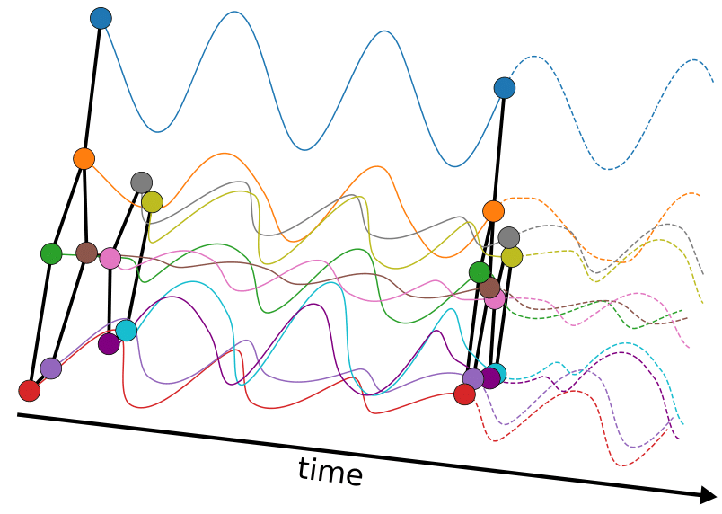

<h1 align='center'> Graph-Coupled Oscillator Networks </h1>

This repository contains the implementation to reproduce the numerical experiments 
of the **ICML 2022** paper [Graph-Coupled Oscillator Networks](https://arxiv.org/abs/2202.02296)

<p align="center">

</p>

### Requirements
Main dependencies (with python >= 3.7):<br />
torch==1.9.0<br />
torch-cluster==1.5.9<br />
torch-geometric==2.0.3<br />
torch-scatter==2.0.9<br />
torch-sparse==0.6.12<br />
torch-spline-conv==1.2.1<br />
torchdiffeq==0.2.2

Commands to install all the dependencies in a new conda environment <br />
*(python 3.7 and cuda 10.2 -- for other cuda versions change accordingly)*
```
conda create --name graphCON python=3.7
conda activate graphCON

pip install ogb pykeops
pip install torch==1.9.0
pip install torchdiffeq -f https://pytorch-geometric.com/whl/torch-1.9.0+cu102.html

pip install torch-scatter -f https://pytorch-geometric.com/whl/torch-1.9.0+cu102.html
pip install torch-sparse -f https://pytorch-geometric.com/whl/torch-1.9.0+cu102.html
pip install torch-cluster -f https://pytorch-geometric.com/whl/torch-1.9.0+cu102.html
pip install torch-spline-conv -f https://pytorch-geometric.com/whl/torch-1.9.0+cu102.html
pip install torch-geometric
pip install wandb
```

### Run the experiments
To run each experiment, navigate into `src/exp_dir` 
(change `exp_dir` to the name of the corresponding experiment directory).
There, simply do
```
python run_GNN.py --kwargs
```
where kwargs are specified in each individual `run_GNN.py` file.

### Dataset and preprocessing
All data gets downloaded and preprocessed automatically and stored in `./data` directory 
(which gets automatically created the first time one of the experiments is run).

### Usage
GraphCON is a general framework for "stacking" many GNN layers (aka message passing mechanisms)
in order to obtain a deep GNN which overcomes the oversmoothing problem. <br />

Given any standard GNN layer (such as *GCN* or *GAT*), 
GraphCON can be implemented using **PyTorch (geometric)** as simple as that: 
```python
from torch import nn
import torch
import torch.nn.functional as F


class GraphCON(nn.Module):
    def __init__(self, GNNs, dt=1., alpha=1., gamma=1., dropout=None):
        super(GraphCON, self).__init__()
        self.dt = dt
        self.alpha = alpha
        self.gamma = gamma
        self.GNNs = GNNs  # list of the individual GNN layers
        self.dropout = dropout

    def forward(self, X0, Y0, edge_index):
        # set initial values of ODEs
        X = X0
        Y = Y0
        # solve ODEs using simple IMEX scheme
        for gnn in self.GNNs:
            Y = Y + self.dt * (torch.relu(gnn(X, edge_index)) - self.alpha * Y - self.gamma * X)
            X = X + self.dt * Y

            if (self.dropout is not None):
                Y = F.dropout(Y, self.dropout, training=self.training)
                X = F.dropout(X, self.dropout, training=self.training)

        return X, Y
```

A deep GraphCON model using for instance [Kipf & Welling's GCN](https://arxiv.org/abs/1609.02907)
as the underlying message passing mechanism can then be written as

```python
from torch_geometric.nn import GCNConv


class deep_GNN(nn.Module):
    def __init__(self, nfeat, nhid, nclass, nlayers, dt=1., alpha=1., gamma=1., dropout=None):
        super(deep_GNN, self).__init__()
        self.enc = nn.Linear(nfeat, nhid)
        self.GNNs = nn.ModuleList()
        for _ in range(nlayers):
            self.GNNs.append(GCNConv(nhid, nhid))
        self.graphcon = GraphCON(self.GNNs, dt, alpha, gamma, dropout)
        self.dec = nn.Linear(nhid, nclass)

    def forward(self, x, edge_index):
        # compute initial values of ODEs (encode input)
        X0 = self.enc(x)
        Y0 = X0
        # stack GNNs using GraphCON
        X, Y = self.graphcon(X0, Y0, edge_index)
        # decode X state of GraphCON at final time for output nodes
        output = self.dec(X)
        return output
```
This is just an easy example to demonstrate the **simple usage of GraphCON**. 
You can find the full GraphCON models we used in our experiments in the `src` directory.

# Citation
If you found our work useful in your research, please cite our paper at:
```bibtex
@article{graphcon,
  title={Graph-Coupled Oscillator Networks},
  author={Rusch, T Konstantin and Chamberlain, Benjamin P and Rowbottom, James and Mishra, Siddhartha and Bronstein, Michael M},
  journal={arXiv preprint arXiv:2202.02296},
  year={2022}
}
```
(Also consider starring the project on GitHub.)
